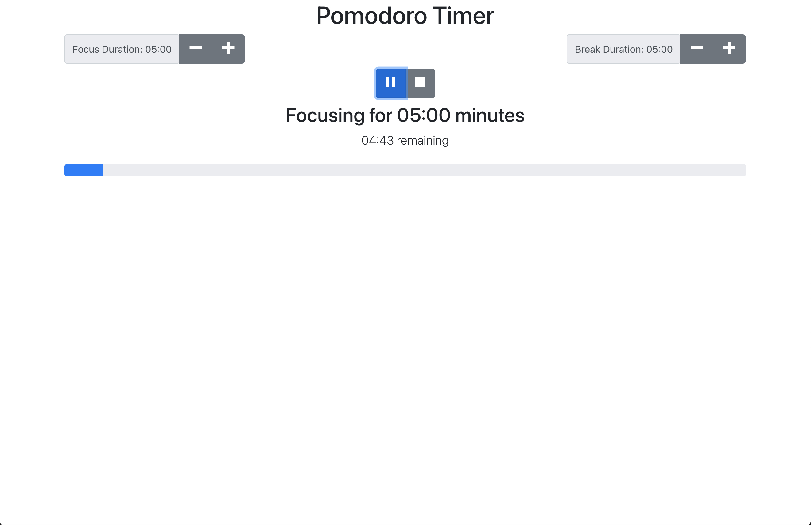
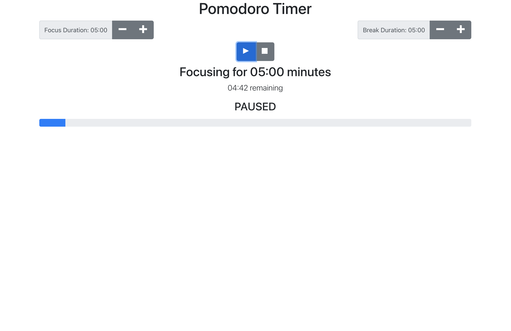

# Pomodoro Timer
Is an application that allows you to set a focus timer with a working status bar to show remaining time available and immediately goes into a break for the set duration.

## Screenshots:
### Home Page

### Status Bar

### Timer When Paused

## Technology 
### Built With:
* JavaScript, React, and React Hooks
* Created with [create-react-app](https://github.com/facebook/create-react-app)
